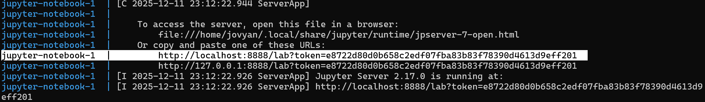

# Predicting Income Levels Using the Adult Census Dataset

## Contributors
- Sean Brown
- Tiantong Yin
- Yanxin Liang
- Siting Wang

Report URL: https://seanbrown12345.github.io/ml-salary-estimator/


## About
This project predicts whether an individual's annual income exceeds $50K using the Adult Census Income dataset from the UCI Machine Learning Repository. The analysis is implemented as a fully reproducible machine learning pipeline, including data downloading, cleaning, exploratory analysis, model training, and report generation. The workflow is structured using modular Python scripts, Quarto for reporting, and a containerized environment to ensure consistent and reproducible results. The goal is to identify key demographic and socioeconomic factors associated with higher income while demonstrating best practices in reproducible data science.

## Data
This project uses the Adult Census Income dataset from the
UCI Machine Learning Repository (https://archive.ics.uci.edu/dataset/2/adult).

The dataset contains demographic and employment-related variables collected from the 1994 U.S. Census, and the prediction target is whether an individual’s income exceeds $50K/year.

All raw data are automatically downloaded and processed through the project’s scripts (see Usage section), ensuring full reproducibility without requiring users to manually handle any data files.

## Script Overview
This project uses four modular Python scripts that together form a fully reproducible machine learning pipeline:

1. scripts/data_download.py – Download raw data

Downloads the Adult Census dataset from a given URL and saves it into the data/raw directory.

2. scripts/clean_split_data.py – Clean and prepare data

Reads the raw dataset, performs cleaning, preprocesses columns, and splits the data into training and test sets.

3. scripts/eda.py – Exploratory data analysis

Creates exploratory data visualizations and saves the output figures to results/figures.

4. scripts/model_training.py – Model fitting and evaluation

Trains predictive models on the processed data, evaluates model performance, and outputs results (tables & figures) to the results/ directory.

## Report Document (Quarto)
Our main report is written in Quarto (reports/income_level_predictor_report.qmd).
This document narrates the analysis, incorporates figures and tables generated from the scripts, and hides all code in the final rendered PDF.
The report is rendered using:
```bash
quarto render reports/income_level_predictor_report.qmd --to pdf
```

## Dependencies
- [Docker](https://www.docker.com/) 
- [VS Code](https://code.visualstudio.com/download)
- [VS Code Jupyter Extension](https://marketplace.visualstudio.com/items?itemName=ms-toolsai.jupyter)
  
## Reproducible Pipeline (Makefile)

This project uses a `Makefile` as a single driver script to run the entire analysis pipeline from start to finish in a fully reproducible way.

The Makefile specifies all required arguments and ensures that each step of the workflow is executed in the correct order.

### Makefile targets

- `make all`  
Runs the complete analysis pipeline, including:
1. Downloading the raw data
2. Cleaning and splitting the data
3. Performing exploratory data analysis
4. Training and evaluating models
5. Rendering the final Quarto report

- `make clean`  
Removes all generated files (processed data, results, and rendered reports), allowing the entire analysis to be rerun from a clean state.

### Recommended usage

From the project root directory **inside the Docker container**, run:
```bash
make all
```
To remove all generated outputs:
```bash
make clean
```
Note: The steps in the Usage section below describe the underlying commands for transparency, but running make all is the recommended way to reproduce the full analysis.

## Usage
Follow the steps below to reproduce the analysis.

### 1. Setup
1. Make sure Docker Desktop is running
2. Clone this repository and move into the project folder:
   ```bash
   git clone https://github.com/SeanBrown12345/ml-salary-estimator.git
   cd ml-salary-estimator
   ```
3. Start the Docker container by running this command in the terminal:
   ```bash
   docker compose up
   ```

In the terminal, look for a URL that starts with http://127.0.0.1:8888/lab?token= (See Below). Copy and paste that URL into your browser to open JupyterLab inside the Docker container.




Once the container is running, open a new terminal inside the container to run the following steps.

### 2. Download raw data
```bash
python scripts/data_download.py \
  --url "https://archive.ics.uci.edu/static/public/2/adult.zip" \
  --destination_path data/raw
```

### 3. Clean and split data
```bash
python scripts/clean_split_data.py \
  --input-path data/raw/adult.data \
  --output-train-path data/processed/train.data \
  --output-test-path data/processed/test.data \
  --test-size 0.6 \
  --random-state 123 \
  --target-col income
```

### 4. Run EDA (outputs figures to results/figures)
```bash
python scripts/eda.py \
  --input_path data/processed/train.data \
  --output_path results/figures
```

### 5. Train models and generate results (tables & figures)
```bash
python scripts/model_training.py \
  --train data/processed/train.data \
  --test data/processed/test.data \
  -o results/
```

### 6. Render the final report as PDF
```bash
quarto render report/income_level_predictor_report.qmd --to pdf
```
## Developer Dependencies
 - `conda` version 25.7.0 or higher
 - `conda-lock` version 3.0.4 or higher

## Updating the Computational Environment
If new dependencies are added (e.g., new Python packages or Quarto), update the environment by:
1. Adding the dependency to `environment.yml`
2. Regenerating the lockfile:
```bash
conda-lock --file environment.yml --lockfile conda-lock.yml
```

## License

The written documentation and report in this repository are licensed under the  
**Creative Commons Attribution–NonCommercial–NoDerivatives 4.0 International (CC BY-NC-ND 4.0)** license.

The source code in this repository is released under the **MIT License**.

For full details, see the `LICENSE` file included in this repository.

## References

- Dua, Dheeru, and Casey Graff. 2019. *UCI Machine Learning Repository: Adult Data Set*. University of California, Irvine, School of Information and Computer Sciences.  
  https://archive.ics.uci.edu/dataset/2/adult

- Kohavi, Ron. 1996. “Scaling Up the Accuracy of Naive-Bayes Classifiers: A Decision-Tree Hybrid.” *Proceedings of the Second International Conference on Knowledge Discovery and Data Mining (KDD)*.  
  https://dl.acm.org/doi/10.5555/3001460.3001507

- Lichman, Moshe. 2013. *Adult Data Set Documentation*. UCI Machine Learning Repository.  
  https://archive.ics.uci.edu/ml/machine-learning-databases/adult/adult.names

- UCI Machine Learning Repository. “Adult Data Set – Original Sources and Description.”  
  https://archive.ics.uci.edu/ml/datasets/Adult
