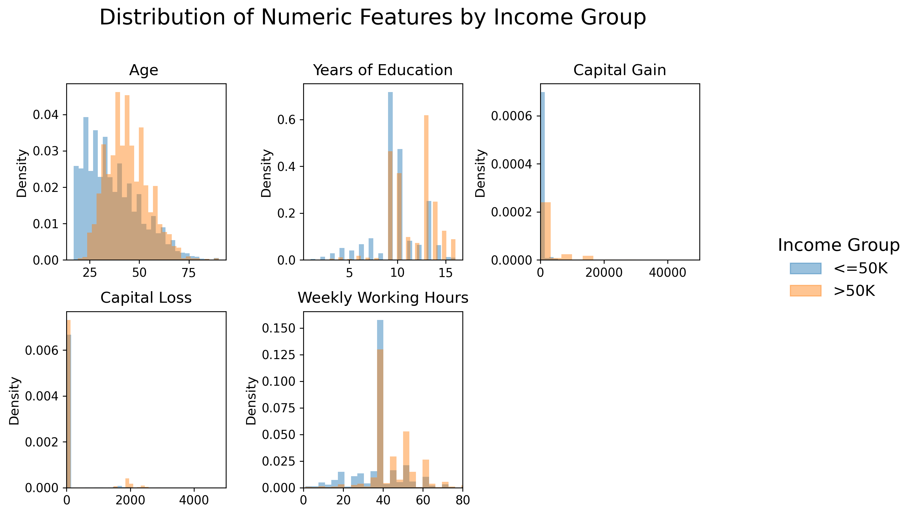
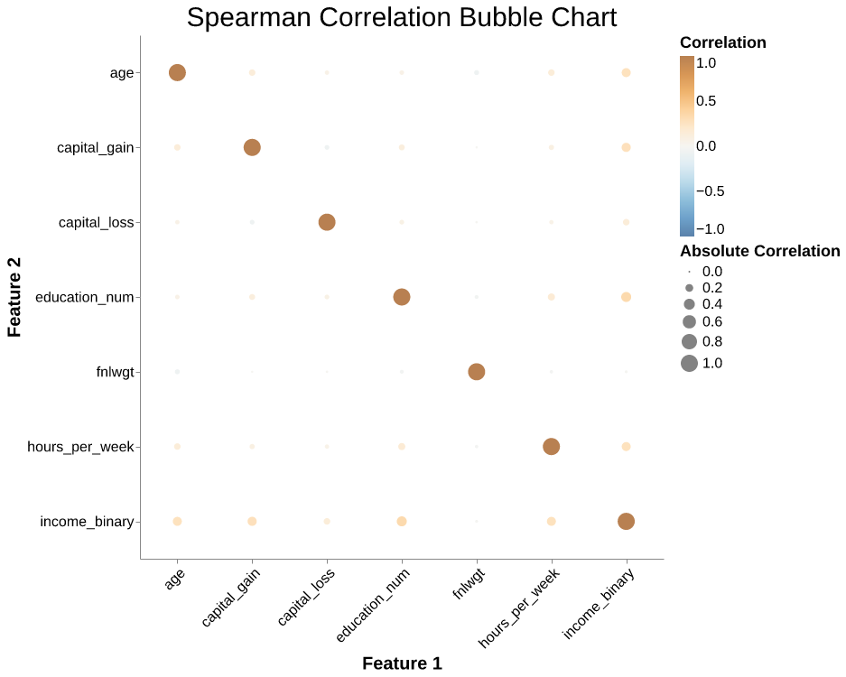
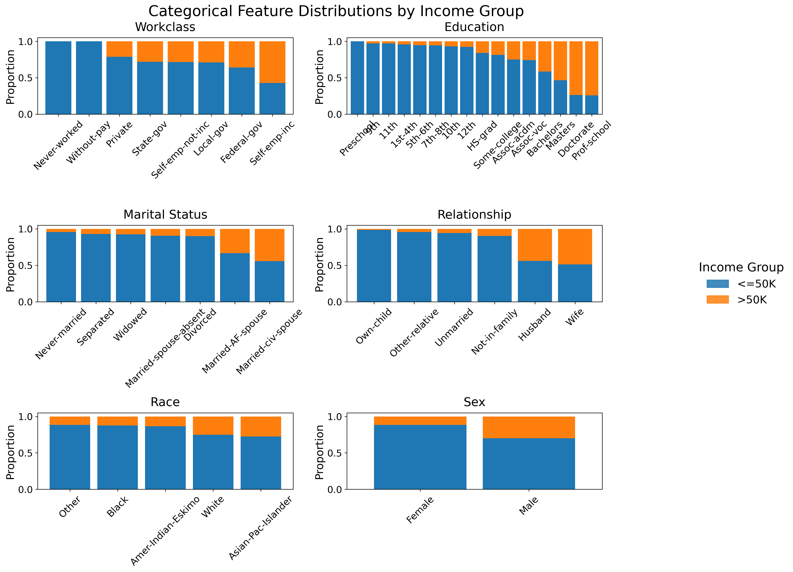
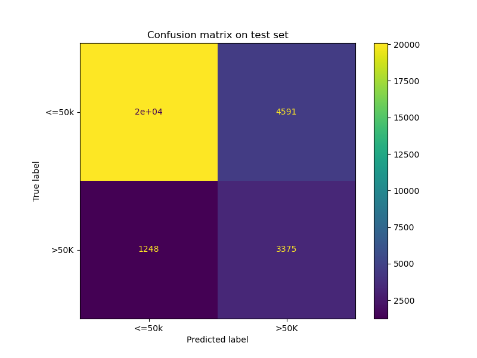
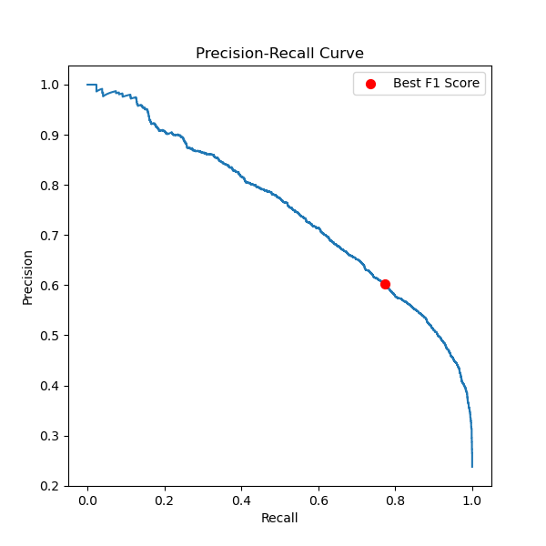

```{python}
import pandas as pd
from IPython.display import Markdown, display
```

```{python}
baseline_comparison = pd.read_csv("../results/tables/baseline_comparison.csv").round(2)
classification_report = pd.read_csv("../results/tables/classification_report.csv").round(2)
tuning_results = pd.read_csv("../results/tables/tuning_results.csv").round(2)

```


# Summary
In this project, we examine whether demographic and employment-related factors can be used to predict if an individual’s annual income exceeds $50K, using the Adult Census Income dataset. After cleaning the data and preparing the features, we compared several classification models, including logistic regression, SVM, and random forest. Logistic regression provided the strongest baseline performance, and after further tuning, the final model reached an accuracy of `{python} classification_report.iloc[2, 1]` and a weighted average F1 score of  `{python} classification_report.iloc[4, 3]` on the test set. While the model performs well on the majority class, it continues to face challenges in identifying higher-income individuals due to class imbalance. Overall, our findings suggest that income prediction is feasible, though additional techniques—such as resampling or more advanced models—may help improve performance on the minority class.


# Introduction

Income inequality has reached a record high in Canada within the recent years [@statcan]. Increase in Canada's wealth gap has been shown to perpetuate poverty cycles, affect economic mobility, and limit socioeconomic opportunities [@income_mobility]. Understanding the individual factors associated with income level could help governments and policy makers better address these issues. 

In this project, we seek to build a machine learning model capable of accurately predicting whether an individual’s income exceeds 50,000. To do such classification, our model will consider factors such as age, education level, occupation, marital status, and gender just to name a few. We believe an income classification model to be valuable because of its ability to identify broad patterns, and highlight features that contribute most to high income status. These insights could also shed light on structural inequalities, economic trends, and educational impacts. Although a human could perform this task reasonably accurately, a machine learning model enables scalability, and limits the biases present in human decision making. Therefore, our goal is to build a model that uses relevant features to predict income status, and evaluate how it performs on such tasks.

# Methods
## Data
The data set used in this project is the Adult census income dataset. It was originally extracted from the 1994 U.S. Census database by Barry Becker.  In 1996, the dataset was donated to the UCI Machine Learning Repository with the collaboration of Ronny Kohavi [@becker_adult], the dataset can be found here: https://archive.ics.uci.edu/dataset/2/adult. The dataset contains 48,842 rows and 14 columns. We split the data into a 40% training set and a 60% test set. Each row in the data set represents an individual’s personal and demographic information, including the income class label (whether their annual income exceeded $50K or not) and attributes such as age, education level, occupation, and hours per week.

To examine whether each predictor may help discriminate between the two income groups (<=50K vs. >50K), we first explored the numeric and categorical features separately, using visualization methods implemented with Altair [@altair]


### Numeric Features

{#fig-numeric-histograms width=110%}

@fig-numeric-histograms illustrates that several numeric features show clear distributional differences between the two income groups. Overall, we observe noticeable shifts in the distributions of age, education, and working hours, with the >50K group generally concentrated in higher-value ranges. In contrast, capital-gain and capital-loss are highly skewed and mostly zero, but the >50K group displays relatively more non-zero values. These differences suggest that some numeric features may carry meaningful signals for predicting income, while others may require transformations or special handling due to extreme skewness.


{#fig-correlation_plot}

@fig-correlation_plot shows the pairwise Spearman correlations among the numeric predictors and their relationship to the income response variable. The explanatory variables do not exhibit strong monotonic relationships with one another, indicating low dependency and minimal multicollinearity. However, several of these predictors show meaningful associations with the income response variable, suggesting that they may provide useful signal for distinguishing between the two income groups.


### Categorical Features


{#fig-categorical_distribution width=110%}


@fig-categorical_distribution summarizes how the two income groups are distributed across several categorical predictors. Across most features, the proportions of individuals earning >50K and <=50K vary noticeably from one category to another. Some categories show a higher share of >50K earners, while others are almost entirely composed of the <=50K group. These uneven distributions indicate that the categorical predictors are informative for distinguishing income levels. Rather than exhibiting uniform patterns, many features display clear shifts in income composition across their categories, suggesting that they capture meaningful differences relevant for predicting income outcomes.

## Analysis
To build a classification model, all columns in the dataset were used except final weight (irrelevant data), education-num (redundant information with the education column), and race (for ethical considerations). All columns are imputed and then transformed according to their data types. We compare the performance of SVM RBF, logistic regression, and random forest, using their default parameters. We then select the top performing model for hyperparameter and decision threshold tuning with cross validation. We evaluate the models using F1 score due to the class imbalance.


{#fig-conf-mat width=100%}

{#fig-pre width=100%}

# Results & Discussion
The initial experiment revealed that the logistic regression model has the highest base F1 score of `{python} baseline_comparison.iloc[1, 1]`. After tuning the hyperparameter C and the decision threshold, we evaluated our final model on the test set. Our model achieved a final accuracy of `{python} classification_report.iloc[2, 1]` and a weighted average F1 score of  `{python} classification_report.iloc[4, 3]`.

As seen in @fig-pre, models perform well on the majority class (income <= 50K), with a precision and recall of `{python} classification_report.iloc[0, 1]` and `{python} classification_report.iloc[0, 2]` respectively. On the minority class (income > 50K), our model has a recall of `{python} classification_report.iloc[1, 2]`, meaning it catches 74% of the minority class. We only have a `{python} classification_report.iloc[1, 1]` precision on the minority class, which implies that there are many false positives. In conclusion, our model is tuned to be sensitive to catch many cases where one’s income is above 50K, but also creates many false alarms.

# Future Works

To improve the model, we propose some solutions to be done in further works. First, our decision threshold is tuned to maximize F1 score. Instead of this, we could select a threshold manually, depending on if we want to focus more on recall or precision. Instead of using class_weight=’balanced’ to give the minority class a heavier weight, another common and often better approach is to oversample the minority class, creating synthetic data until the classes are balanced. Finally, with the suboptimal results of both the recall and precision of the minority class, we suspect our models are not complex enough to accurately model the data. Other models such as XGBoost or neural networks could be tested to see if there is an improvement.

# References


